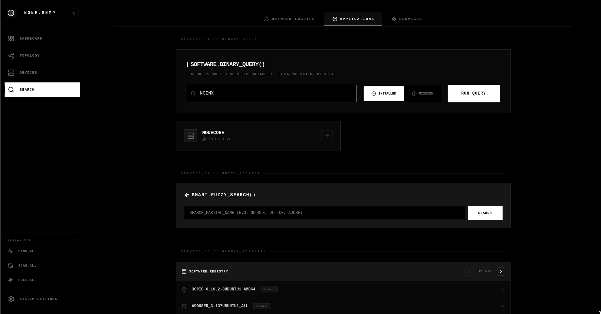
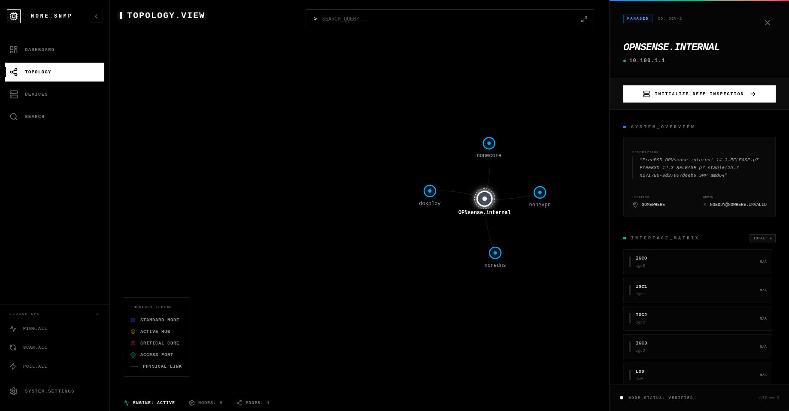
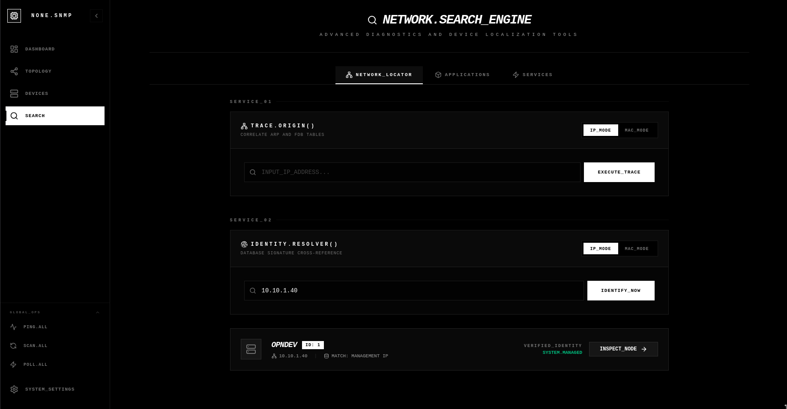
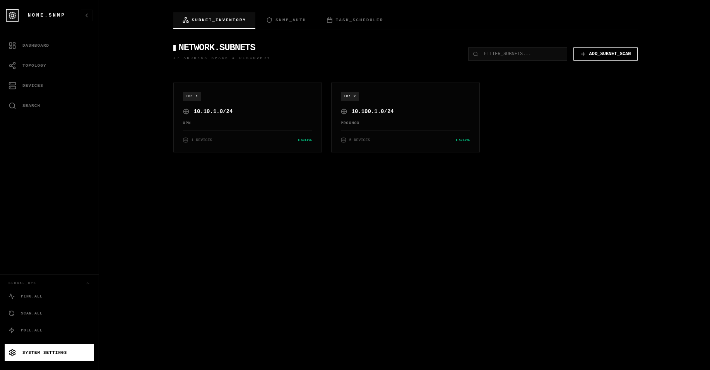
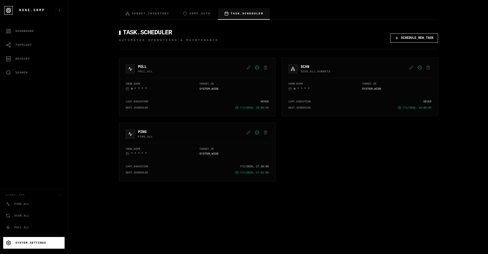
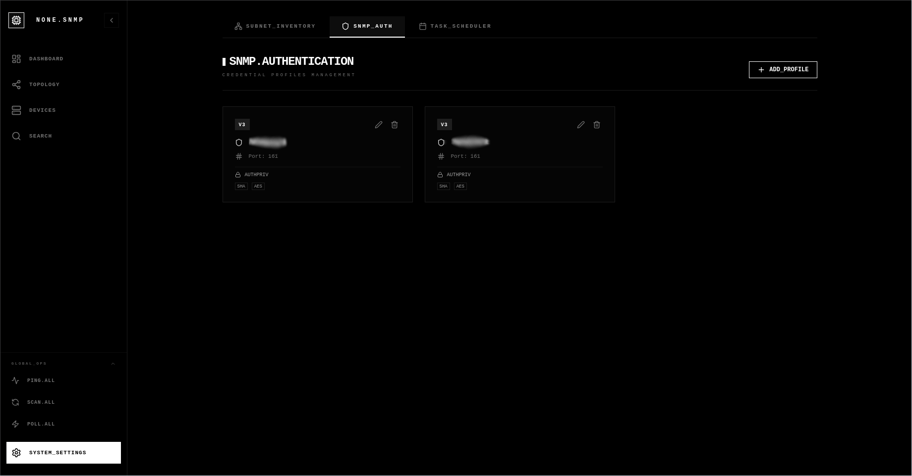

# NONE.SNMP

Este directorio contiene la configuración de Docker Compose para desplegar la solución de monitorización SNMP.

## Repositorios

- [Backend](https://github.com/Nonetss/none.snmp-backend)
- [Frontend](https://github.com/Nonetss/none.snmp-frontend)


## Vista Previa

| Dashboard | Detalle de Dispositivo |
| :---: | :---: |
|  |  |

| Explorador de Aplicaciones | Grafo de Red |
| :---: | :---: |
|  |  |

| Búsqueda de Red | Gestión de Subredes |
| :---: | :---: |
|  |  |

| Tareas Programadas | Autenticación SNMP |
| :---: | :---: |
|  |  |

## Opciones de Despliegue

Disponemos de tres opciones de despliegue. **Se recomienda usar la imagen unificada** para la mayoría de los casos.

---

### 🚀 Imagen Unificada (Recomendado)
Ubicación: `./` (raíz del directorio docker)

Esta es la opción más simple. Una única imagen Docker que contiene tanto el backend como el frontend, reduciendo la complejidad del despliegue.

*   **Ventajas**:
    - Solo 2 contenedores (app + database) en lugar de 3
    - Menor consumo de recursos
    - Configuración más sencilla
    - Ideal para despliegues en un solo servidor

*   **Despliegue**:
    ```bash
    docker compose up -d
    ```

*   **Configuración (`compose.yml`)**:
    ```yaml
    services:
      app:
        container_name: none-snmp
        image: ghcr.io/nonetss/none-snmp:latest
        restart: always
        environment:
          - DATABASE_URL=postgresql://${POSTGRES_USER:-postgres}:${POSTGRES_PASSWORD:-postgres}@database:5432/${POSTGRES_DB:-postgres}
        ports:
          - '4321:80'
        depends_on:
          database:
            condition: service_healthy

      database:
        container_name: none-snmp-database
        image: postgres:16
        restart: always
        environment:
          - POSTGRES_USER=${POSTGRES_USER:-postgres}
          - POSTGRES_PASSWORD=${POSTGRES_PASSWORD:-postgres}
          - POSTGRES_DB=${POSTGRES_DB:-postgres}
        volumes:
          - postgres_data:/var/lib/postgresql/data
        healthcheck:
          test:
            [
              'CMD-SHELL',
              'pg_isready -U ${POSTGRES_USER:-postgres} -d ${POSTGRES_DB:-postgres}',
            ]
          interval: 5s
          timeout: 5s
          retries: 5

    volumes:
      postgres_data:
    ```

---

### 🌐 Bridge Network (Imágenes Separadas)
Ubicación: `./bridge-network/`

Esta configuración usa imágenes separadas para backend y frontend. Úsala si necesitas escalar o actualizar cada servicio de forma independiente.

*   **Ventajas**:
    - Mayor flexibilidad para escalar backend o frontend por separado
    - Actualizaciones independientes de cada componente
    - Mejor para entornos de desarrollo o cuando necesitas depurar

*   **Cuándo usarla**:
    - Necesitas escalar horizontalmente el backend
    - Quieres actualizar frontend y backend por separado
    - Desarrollo local con hot-reload

*   **Despliegue**:
    ```bash
    cd bridge-network
    docker compose up -d
    ```

*   **Configuración (`compose.yml`)**:
    ```yaml
    services:
      backend:
        container_name: none-snmp-backend
        image: ghcr.io/nonetss/none-snmp-backend:v0.4.2
        restart: always
        environment:
          - DATABASE_URL=postgresql://${POSTGRES_USER:-postgres}:${POSTGRES_PASSWORD:-postgres}@database:5432/${POSTGRES_DB:-postgres}
        depends_on:
          database:
            condition: service_healthy
        command: >
          sh -c "bunx drizzle-kit migrate --config drizzle.config.ts && bun run src/index.ts"

      frontend:
        container_name: none-snmp-frontend
        image: ghcr.io/nonetss/none-snmp-frontend:v0.4.2
        restart: always
        environment:
          - BACKEND_URL=http://backend:3000
        ports:
          - '4321:80'
        depends_on:
          - backend

      database:
        container_name: none-snmp-database
        image: postgres:16
        restart: always
        environment:
          - POSTGRES_USER=${POSTGRES_USER:-postgres}
          - POSTGRES_PASSWORD=${POSTGRES_PASSWORD:-postgres}
          - POSTGRES_DB=${POSTGRES_DB:-postgres}
        volumes:
          - postgres_data:/var/lib/postgresql/data
        healthcheck:
          test:
            [
              'CMD-SHELL',
              'pg_isready -U ${POSTGRES_USER:-postgres} -d ${POSTGRES_DB:-postgres}',
            ]
          interval: 5s
          timeout: 5s
          retries: 5

    volumes:
      postgres_data:
    ```

---

### 🔧 Host Network (Solución para problemas de Firewall)
Ubicación: `./host-network/`

Esta configuración pone el backend en la red del host directamente. Úsala si experimentas problemas de conectividad SNMP debido a que tu gateway de red bloquea las peticiones provenientes de Docker.

*   **Ventajas**:
    - Máxima compatibilidad con routers/gateways
    - El tráfico sale con la IP física de la máquina
    - Soluciona problemas de firewall con SNMP

*   **Cuándo usarla**:
    - Los pings o peticiones SNMP fallan desde Docker
    - Tu router (ej. OPNsense) bloquea el tráfico de la red Docker
    - No puedes/quieres añadir rutas estáticas en tu firewall

*   **Despliegue**:
    ```bash
    cd host-network
    docker compose up -d
    ```

---

## Comparativa Rápida

| Característica | Unificada | Bridge | Host |
|----------------|-----------|--------|------|
| Contenedores | 2 | 3 | 3 |
| Consumo recursos | ⭐ Bajo | Medio | Medio |
| Complejidad | ⭐ Simple | Media | Media |
| Escalabilidad | Básica | ⭐ Alta | ⭐ Alta |
| Compatibilidad firewall | Media | Media | ⭐ Alta |
| Actualizaciones independientes | ❌ | ✅ | ✅ |
