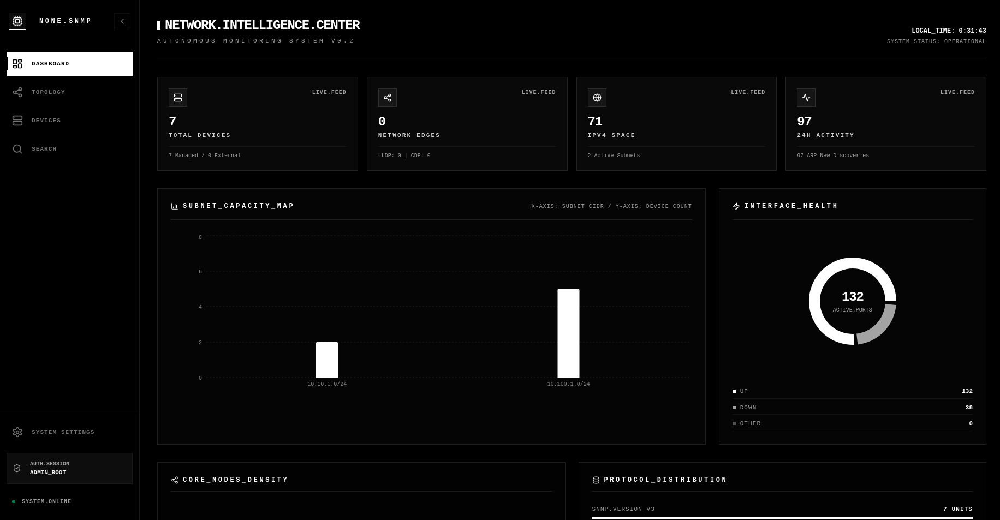
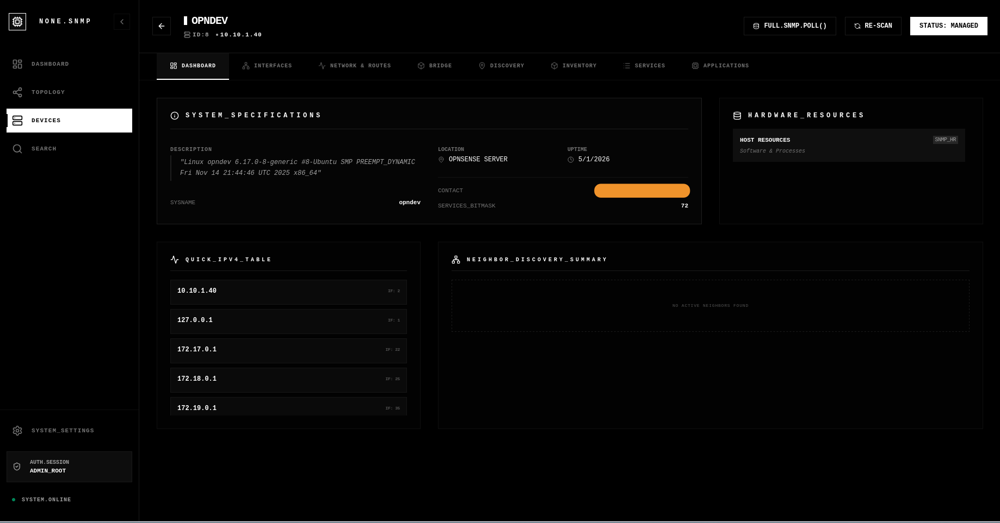
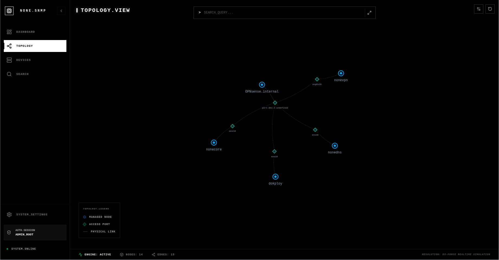
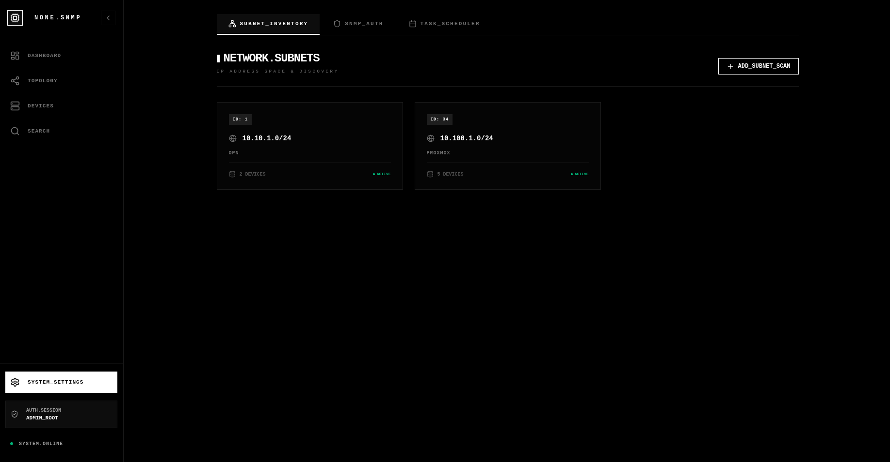
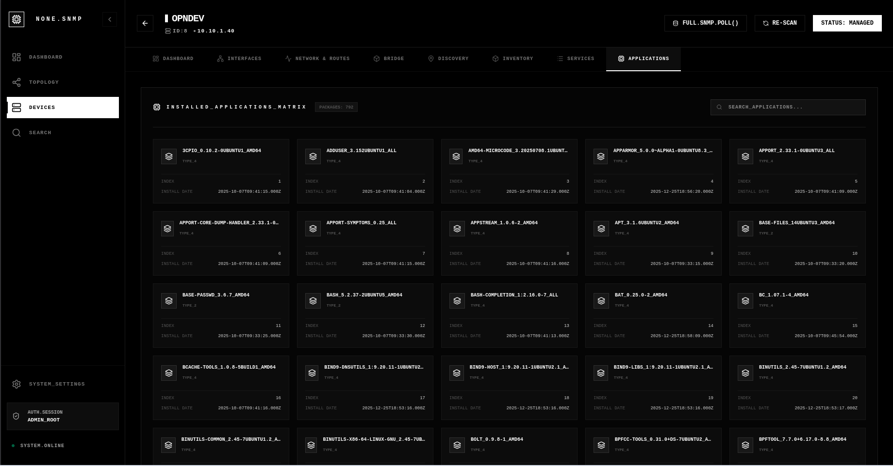

# NONE.SNMP

Este directorio contiene la configuración de Docker Compose para desplegar la solución de monitorización SNMP.

## Vista Previa

| Dashboard | Dispositivos | Grafo de Red |
| :---: | :---: | :---: |
|  |  |  |

| Ajustes | Detalles del Dispositivo |
| :---: | :---: |
|  |  |

## Opciones de Despliegue

Hemos preparado dos tipos de despliegue. **Se recomienda intentar primero el despliegue en modo Bridge** (estándar). Si tras el despliegue experimentas problemas de conectividad (pings fallidos o timeouts de SNMP) debido al firewall de tu router, utiliza el modo Host.

### 1. Bridge Network (Modo Recomendado)
Ubicación: `./bridge-network/`

Esta es la configuración estándar y aislada de Docker. Úsala para mantener el aislamiento entre contenedores. Si tu router (ej. OPNsense) bloquea el tráfico, deberás añadir una ruta estática para la red de Docker o pasar al modo Host.

*   **Ventaja**: Mayor aislamiento y seguridad.
*   **Despliegue**:
    ```bash
    cd bridge-network
    docker compose up -d
    ```

### 2. Host Network (Solución para problemas de Firewall)
Ubicación: `./host-network/`

Esta configuración pone el backend en la red del host directamente. Úsala si el modo Bridge no funciona debido a que tu gateway de red bloquea las peticiones SNMP provenientes de Docker.

*   **Ventaja**: Máxima compatibilidad con routers/gateways (el tráfico sale con la IP física de la máquina).
*   **Despliegue**:
    ```bash
    cd host-network
    docker compose up -d
    ```


