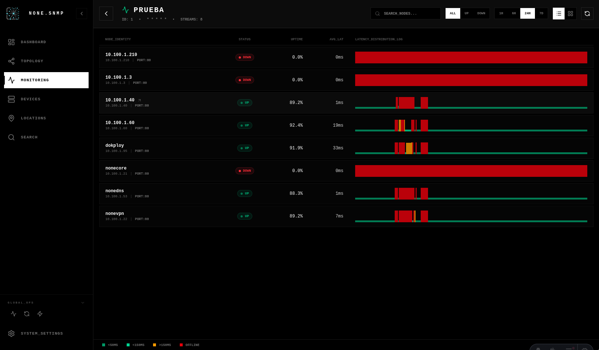

# NONE.SNMP - Imágenes Docker

Este repositorio contiene las imágenes Docker para desplegar la solución completa de monitorización SNMP. Disponemos de **tres imágenes** que puedes usar según tus necesidades.

## 🐳 Imágenes Disponibles

### 1. Imagen Unificada (Recomendada)

**Imagen:** `ghcr.io/nonetss/none.snmp:latest`

Una única imagen que contiene tanto el backend como el frontend, ideal para la mayoría de despliegues.

```bash
docker pull ghcr.io/nonetss/none.snmp:latest
```

### 2. Imagen Backend

**Imagen:** `ghcr.io/nonetss/none.snmp-backend:latest`

Solo el backend API con todas las funcionalidades de descubrimiento y gestión SNMP.

```bash
docker pull ghcr.io/nonetss/none.snmp-backend:latest
```

### 3. Imagen Frontend

**Imagen:** `ghcr.io/nonetss/none.snmp-frontend:latest`

Solo el frontend (dashboard web) que se conecta a un backend externo.

```bash
docker pull ghcr.io/nonetss/none.snmp-frontend:latest
```

---

## 🚀 Despliegue Rápido

### Opción 1: Imagen Unificada (Más Simple)

Esta es la opción recomendada para la mayoría de casos. Una sola imagen que ejecuta backend y frontend juntos.

**docker-compose.yml:**

```yaml
services:
  app:
    container_name: none-snmp
    image: ghcr.io/nonetss/none.snmp:latest
    restart: always
    environment:
      - DATABASE_URL=postgresql://${POSTGRES_USER:-postgres}:${POSTGRES_PASSWORD:-postgres}@database:5432/${POSTGRES_DB:-postgres}
    ports:
      - "4321:80"
    depends_on:
      database:
        condition: service_healthy

  database:
    container_name: none-snmp-database
    image: postgres:16
    restart: always
    environment:
      - POSTGRES_USER=${POSTGRES_USER:-postgres}
      - POSTGRES_PASSWORD=${POSTGRES_PASSWORD:-postgres}
      - POSTGRES_DB=${POSTGRES_DB:-postgres}
    volumes:
      - postgres_data:/var/lib/postgresql/data
    healthcheck:
      test:
        [
          "CMD-SHELL",
          "pg_isready -U ${POSTGRES_USER:-postgres} -d ${POSTGRES_DB:-postgres}",
        ]
      interval: 5s
      timeout: 5s
      retries: 5

volumes:
  postgres_data:
```

**Ejecutar:**

```bash
docker compose up -d
```

La aplicación estará disponible en `http://localhost:4321`

---

### Opción 2: Imágenes Separadas (Mayor Flexibilidad)

Usa esta opción si necesitas escalar o actualizar backend y frontend de forma independiente.

**docker-compose.yml:**

```yaml
services:
  backend:
    container_name: none-snmp-backend
    image: ghcr.io/nonetss/none.snmp-backend:latest
    restart: always
    environment:
      - DATABASE_URL=postgresql://${POSTGRES_USER:-postgres}:${POSTGRES_PASSWORD:-postgres}@database:5432/${POSTGRES_DB:-postgres}
    depends_on:
      database:
        condition: service_healthy
    command: >
      sh -c "bunx drizzle-kit migrate --config drizzle.config.ts && bun run src/index.ts"

  frontend:
    container_name: none-snmp-frontend
    image: ghcr.io/nonetss/none.snmp-frontend:latest
    restart: always
    environment:
      - BACKEND_URL=http://backend:3000
    ports:
      - "4321:80"
    depends_on:
      - backend

  database:
    container_name: none-snmp-database
    image: postgres:16
    restart: always
    environment:
      - POSTGRES_USER=${POSTGRES_USER:-postgres}
      - POSTGRES_PASSWORD=${POSTGRES_PASSWORD:-postgres}
      - POSTGRES_DB=${POSTGRES_DB:-postgres}
    volumes:
      - postgres_data:/var/lib/postgresql/data
    healthcheck:
      test:
        [
          "CMD-SHELL",
          "pg_isready -U ${POSTGRES_USER:-postgres} -d ${POSTGRES_DB:-postgres}",
        ]
      interval: 5s
      timeout: 5s
      retries: 5

volumes:
  postgres_data:
```

**Ejecutar:**

```bash
docker compose up -d
```

---

## 📋 Características Principales

### Backend

- **Descubrimiento Inteligente:** Escaneo de subredes mediante ICMP y validación automática de credenciales SNMP (v1, v2c, v3)
- **Topología de Red:** Generación de grafos de conexión cruzando datos de LLDP, CDP, y tablas de reenvío (FDB/Bridge)
- **Inventario Detallado:** Recolección profunda de información de sistema, interfaces, software, procesos, y entidades físicas
- **Programador de Tareas:** Automatización de escaneos mediante expresiones Cron
- **Búsqueda Avanzada:** Localización de dispositivos por IP/MAC y búsqueda "fuzzy" de aplicaciones
- **API Documentada:** OpenAPI con interfaz interactiva (Scalar)

### Frontend

- **Dashboard Moderno:** Interfaz inspirada en terminal para visualización de alta densidad
- **Visualización de Red:** Grafos interactivos de topología de red
- **Monitorización en Tiempo Real:** Métricas de rendimiento y estado de dispositivos
- **Gestión de Subredes:** Configuración y escaneo de rangos de red
- **Búsqueda y Filtrado:** Herramientas avanzadas para localizar dispositivos y servicios

---

## 🎯 ¿Cuándo usar cada imagen?

| Escenario                      | Imagen Recomendada           | Razón                                                |
| ------------------------------ | ---------------------------- | ---------------------------------------------------- |
| Despliegue estándar            | **Unificada**                | Simplicidad, menor consumo de recursos               |
| Escalado horizontal            | **Separadas**                | Puedes escalar backend y frontend independientemente |
| Desarrollo local               | **Separadas**                | Hot-reload y debugging más fácil                     |
| Actualizaciones independientes | **Separadas**                | Actualizar solo backend o solo frontend              |
| Problemas de firewall          | **Separadas + Host Network** | Backend en red del host para SNMP                    |

---

## 🔧 Configuración Avanzada

### Variables de Entorno

#### Backend

- `DATABASE_URL`: URL de conexión a PostgreSQL (requerido)
- `PORT`: Puerto del servidor backend (default: 3000)

#### Frontend

- `BACKEND_URL`: URL del backend API (requerido cuando se usa imagen separada)
- `HOST`: Host del servidor frontend (default: 0.0.0.0)
- `PORT`: Puerto del servidor frontend (default: 80)

### Versiones Específicas

Puedes usar tags específicos en lugar de `latest`:

```bash
# Ver todas las versiones disponibles
docker pull ghcr.io/nonetss/none.snmp:v0.6.0
docker pull ghcr.io/nonetss/none.snmp-backend:v0.6.0
docker pull ghcr.io/nonetss/none.snmp-frontend:v0.6.0
```

Los tags siguen el formato: `{branch}` o `{branch}-{sha}` (ej: `v0.6.0` o `v0.6.0-25ac4b04`)

---

## 📊 Comparativa de Opciones

| Característica                     | Unificada    | Separadas                   |
| ---------------------------------- | ------------ | --------------------------- |
| **Contenedores**                   | 2 (app + db) | 3 (backend + frontend + db) |
| **Consumo de recursos**            | ⭐ Bajo      | Medio                       |
| **Complejidad**                    | ⭐ Simple    | Media                       |
| **Escalabilidad**                  | Básica       | ⭐ Alta                     |
| **Actualizaciones independientes** | ❌           | ✅                          |
| **Hot-reload en desarrollo**       | ❌           | ✅                          |

---

## 🖼️ Vista Previa

|                  Dashboard                  |               Detalle de Dispositivo               |
| :-----------------------------------------: | :------------------------------------------------: |
|  |  |

|          Explorador de Aplicaciones           |                    Grafo de Red                    |
| :-------------------------------------------: | :------------------------------------------------: |
|  |  |

|                 Búsqueda de Red                  |                Gestión de Subredes                |
| :----------------------------------------------: | :-----------------------------------------------: |
|  |  |

|               Tareas Programadas                |             Autenticación SNMP              |
| :---------------------------------------------: | :-----------------------------------------: |
|  |  |

|            Monitorización TCP y NTFY             |
| :----------------------------------------------: |
|  |

---

## 📝 Licencia

Este proyecto está bajo la Licencia GNU General Public License v3.0 (GPLv3). Consulta el archivo [LICENSE](./LICENSE) para más detalles.

---

## 🆘 Soporte

Si encuentras algún problema o tienes preguntas:

1. Revisa la documentación de cada componente
2. Verifica los logs: `docker logs none-snmp`
3. Asegúrate de que las variables de entorno estén correctamente configuradas

---
